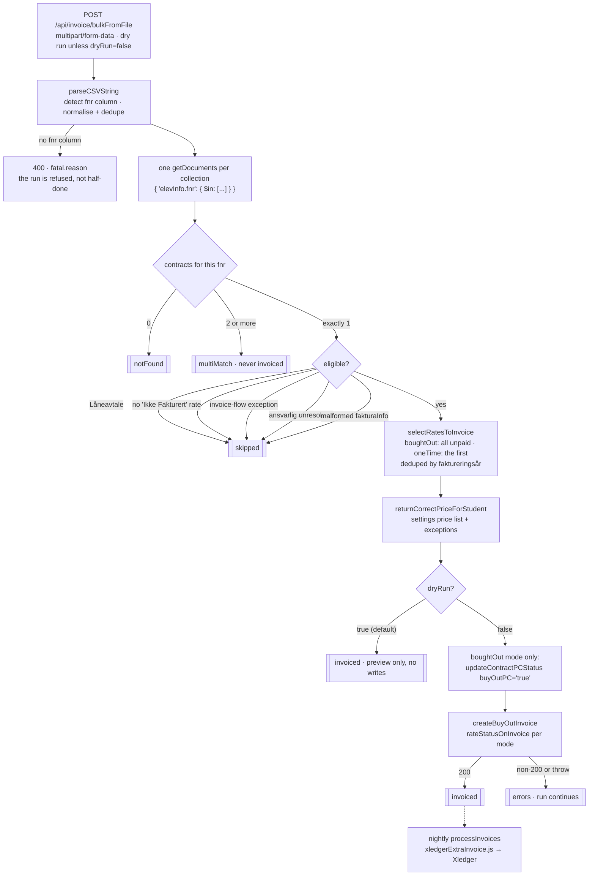

# Masseinnfakturering fra fil

Lets a system administrator upload a CSV of students and invoice every remaining unpaid rate on
their contracts in one call, with a per-student report of everything that could not be done and why.

## Why

A student who never returned their PC is counted as bought out (`pcInfo.boughtOut`), but that is only
correct once every rate that is neither invoiced nor paid has actually been billed. Nothing could do
that for a *list* of students:

- the nightly `normalInvoice` run only ever bills the **current school year's** rate - its candidate
  query filters on `faktureringsår === currentSchoolYear` (`getXledgerInvoiceImports`,
  `src/lib/jobs/serverJobs/xledgerInvoiceImport.js`), so an overdue rate from an earlier year is
  invisible to it forever;
- the only path that bills *all* remaining rates is `handleBoughtOut`
  (`src/lib/jobs/syncPureserviceAssetLifecycle.js`), and that is driven one student at a time by
  Pureservice asset registrations.

So it was done by hand, per student, through the admin cart UI. At the end of a school year that is
several hundred students.

This job is the same work as `handleBoughtOut`, over a file. It deliberately calls
`createBuyOutInvoice` rather than building invoice documents itself, so rate matching, serial-number
minting and the contract write-back can never drift from the single-student path.

## How it works

1. Reads the uploaded CSV with `parseCSVString` (`src/lib/helpers/readAndParseCSV.js`).
2. Finds the fødselsnummer column (see [The file](#the-file)) and normalises every value -
   digits only, left-padded to 11. Rows with an unusable or repeated fnr are reported, not dropped
   silently.
3. Loads every candidate contract in **one query per collection** (`{ 'elevInfo.fnr': { $in: [...] } }`)
   and indexes them by fnr. A student holding more than one contract is reported under `multiMatch`
   and is never invoiced - the job does not guess which contract to bill.
4. Rejects anything that must not be billed: a non-Leieavtale, a contract with no
   `'Ikke Fakturert'` rate left, a student with an invoice-flow exception, an unresolved `ansvarligInfo`,
   or a malformed `fakturaInfo`.
5. Picks the rates - all unpaid rates in `boughtOut` mode, the first in `oneTime` mode - and prices
   each with `returnCorrectPriceForStudent` against the `settings`-collection price list, exactly as
   `handleBoughtOut` and the recurring rent invoicing job do.
6. In `boughtOut` mode, marks the contract bought out via `updateContractPCStatus` (once - skipped if
   the flag is already set).
7. Calls `createBuyOutInvoice`, which flips each rate's status and `løpenummer` on the contract and
   posts one invoice document.

Nothing downstream changes. The invoice lands in `invoices` with `status: 'Ikke Fakturert'`, and the
existing nightly sweep (`processInvoices`, `src/lib/jobs/serverJobs/xledgerExtraInvoice.js`) gates it
on `isRecipientImportedToXledger` and ships it to Xledger.

## Flow at a glance



## The two modes

| | `boughtOut` | `oneTime` |
|---|---|---|
| Rates invoiced | every rate still `'Ikke Fakturert'` | the first such rate, in rate1/2/3 order |
| Rate status written | `'Fakturert - Utkjøp'` | `'Fakturert'` |
| Invoice line text | `Faktura for X - Utkjøp av elev-PC - Faktura n/m` | `Faktura for X - Leie av elev-PC` |
| `pcInfo.boughtOut` | set to `'true'` | untouched |

`oneTime` is **not** a buyout. It bills a single outstanding termin - typically one the nightly run
will never pick up, because that run only looks at the current school year - so it must look like any
ordinary termin invoice, both in the rate status and on the document the recipient reads.

It travels the buyOut rails anyway, because those are the only rails that can bill an *arbitrary*
rate. Three small changes make that safe:

- `createBuyOutInvoice` takes `deps.rateStatusOnInvoice` (default `'Fakturert - Utkjøp'`) and writes
  it to the rate **and** stores it on the invoice document.
- `updateImportedBuyOutDocument` (`xledgerInvoiceImport.js`) reads that field back instead of
  hardcoding the buyout status. It has to: the import writes the contract's rate a *second* time once
  Xledger has the row, and would otherwise relabel a one-off invoice as a buyout on the way back.
- `createBuyOutInvoice` also takes `deps.invoiceLineLabel`, stored on the invoice and used by
  `buildInvoiceLineText` (`xledgerExtraInvoice.js`) to build `Tekst (imp)` - **the sentence printed on
  the invoice line the guardian pays against**. Every other CSV column is already identical between a
  buyout and a normal termin invoice (`Product 4651000`, `Service Type 465`, `SO Group 465`, the same
  pricing function); this text was the only thing that would still have said "Utkjøp av elev-PC" on a
  bill that is not a buyout. With no label stored, the buyout wording is produced byte for byte as
  before.

Invoices created before these fields existed carry no values and behave exactly as they always did.

## The file

Plain CSV, `;` or `,` separated (detected from the header line; Norwegian Excel writes `;`). The
UTF-8 BOM Excel puts in front of the first header is stripped.

The delivered file's header row is:

```
Skole;Fornavn;Etternavn;Klasse;Programområde;Fødselsnummer
```

**One required column: the student's fødselsnummer.** Everything else in the file is ignored -
`Skole`, `Klasse` and `Programområde` are not used for matching or for pricing (the price comes from
`elevInfo.klasse` on the contract, not from the file). The column is auto-detected,
case-insensitively, under any of:

`fnr` · **`fødselsnummer`** · `fodselsnummer` · `føsdelsnummer` · `personnr` · `personnummer` · `ssn` · `elevfnr`

Send `fnrColumn` to name it explicitly. If neither finds a column the whole request is refused with
`400 fnr-column-not-found` and the headers that *were* found. That failure has to be loud: a missing
fnr column invoices nobody while every other part of the run reports success, which reads exactly
like "none of these students were eligible".

> **Excel eats the leading zero.** A fnr is a number to Excel, so roughly a tenth of them arrive 10
> digits long. Values shorter than 11 digits are left-padded with `0`, the same thing the Digitroll
> import does. Spaces, dots and dashes are stripped. There is deliberately **no mod-11 check** - a
> fiktivt fødselsnummer frequently fails it and those are legitimate students here.

> **Format the fødselsnummer column as Text before saving to CSV.** Left as *General*, Excel can write
> the cell in scientific notation - `1,01011E+10` - and the digits are then gone for good; no amount
> of parsing recovers them. Such rows are reported as `fnr-lost-to-excel-formatting` rather than the
> generic `invalid-fnr`, and if the whole column is affected the request is refused with
> `400 no-usable-fnr` and a message naming the fix. Without that distinction the admin gets 775
> identical `invalid-fnr` rows and no hint that the file simply needs re-saving.

Since the sheet arrives as `.xlsx` and this job takes CSV, save it as **CSV (semikolondelt)**. The
`;` separator and the UTF-8 BOM that Norwegian Excel writes are both handled.

Matching is on `elevInfo.fnr` only. Name, school and class are never used to match: the earlier
version of this file carried no identifier at all, and matching hundreds of students by name would
mean billing the wrong person whenever two of them share one.

## Result fields

Every exit path returns the same key set, so a caller never has to null-check a bucket.

```json
{
  "dryRun": true,
  "mode": "boughtOut",
  "collections": ["regular", "pcIkkeInnlevert"],
  "fnrColumn": "fnr",
  "fileRowCount": 775,
  "uniqueFnr": 773,
  "candidateContracts": 741,
  "invoiced":    [{ "fnr": "...", "navn": "...", "contractId": "...", "documentType": "regular",
                    "rates": [{ "rateKey": "rate2", "faktureringsår": "2026", "sum": 1500 }], "total": 1500 }],
  "skipped":     [{ "fnr": "...", "navn": "...", "contractId": "...", "reason": "no-unpaid-rates" }],
  "skippedRates":[{ "fnr": "...", "contractId": "...", "rateKey": "rate2", "faktureringsår": "2025",
                    "reason": "duplicate-faktureringsår" }],
  "multiMatch":  [{ "fnr": "...", "navn": "...", "contracts": [{ "contractId": "...", "documentType": "regular" }] }],
  "notFound":    [{ "fnr": "..." }],
  "invalidRows": [{ "line": 12, "value": "1,01011E+10", "reason": "fnr-lost-to-excel-formatting" }],
  "errors":      [{ "fnr": "...", "contractId": "...", "stage": "createBuyOutInvoice", "error": "..." }],
  "totals":      { "contracts": 0, "rates": 0, "sum": 0 },
  "fatal": null
}
```

`skipped[]` means **the student got no invoice at all**. Reason is one of `not-leieavtale`,
`no-unpaid-rates`, `unmatchable-rates`, `invoice-flow-exception`, `ansvarlig-unresolved`,
`malformed-fakturainfo`, `pending-invoice-exists` (the contract already has an unsent buyOut invoice -
see [The pending-invoice guard](#the-pending-invoice-guard); the entry carries `pendingInvoiceIds`).

`skippedRates[]` is separate on purpose: it is a rate dropped from a contract that **was** invoiced
for its other rates, so a reader scanning `skipped` never has to work out whether an entry means the
whole student or just one rate. Reason is `duplicate-faktureringsår` or `missing-faktureringsår`.

> `no-unpaid-rates` and `unmatchable-rates` are deliberately different. The first means there was
> nothing to do - the normal result of re-running a file, and boring. The second means the contract
> **does** owe money that this job refused to bill because the rate could not be matched safely. Those
> need a human.

`invalidRows[].reason` is `invalid-fnr`, `duplicate-fnr-in-file`, or
`fnr-lost-to-excel-formatting` (the cell was written as `1,01011E+10`; see [The file](#the-file)).
`line` is the line number as Excel shows it (header counted), and `value` is the offending cell -
the rest of the row is not echoed back, since it is the administrator's own file.

`errors[].stage` is `boughtOut-flag` (the flag write failed; the rates were still invoiced) or
`createBuyOutInvoice`. A student can appear in both `errors` and `invoiced` for the first of those.

`fatal` is non-null only when the request could not be acted on at all - then the endpoint answers
400 and every bucket is empty except `invalidRows`. Reasons: `invalid-mode`, `invalid-collections`,
`empty-file`, `fnr-column-not-found`, `no-usable-fnr`, `price-list-unavailable`.

> **The report carries real fødselsnumre; the logs mask them.** The administrator uploaded these
> numbers and cannot act on a masked one - `notFound` is useless if you cannot tell which student it
> was. The endpoint is admin-only. Every log line still goes through `maskFnr`.

A `200` is **not** "everything worked". A run where every student failed is still a completed run;
the per-student buckets are where that shows.

## Dry run

`dryRun` defaults to **true inside the job**, and the endpoint omits the option entirely when the
form field is absent - so posting this endpoint by accident previews, it does not bill. Writes happen
only on the literal string `false`. Same convention as the `dev/` job routes.

A dry run does no writes at all - neither `createBuyOutInvoice` nor `updateContractPCStatus` is
called - but still reports the exact rates and sums that would be billed. Read the report before
turning writes on.

## The pending-invoice guard

Submitting the same file twice - a double-click, or a retry after a timeout - would otherwise invoice
every student a second time. The rate status alone does not prevent it: the first run's invoice sits
in `invoices` as `'Ikke Fakturert'` for a while before anything flips the contract, and a second run
launched inside that window sees a contract that still looks unbilled.

So the job checks, **per contract and as a fresh read**, whether an unsent buyOut invoice already
exists, and skips with `pending-invoice-exists` if so. A pre-fetched answer would be exactly as stale
as the rate status that let the duplicate through, which is why it is not folded into the bulk
pre-filter. It runs after the cheap checks, so a Låneavtale costs no lookup, and it runs on dry runs
too so a preview never promises an invoice the real run would refuse.

The lookup is scoped to `status: 'Ikke Fakturert'` deliberately: an invoice that has already been sent
must not block a legitimate later run for that contract's *remaining* rates.

This narrows the window to the milliseconds between the query and the insert. It does not close it
absolutely - only a conditional update in Mongo would - but it catches the realistic case, where the
second run reaches a student the first has already finished. If duplicates do get through,
`repairDuplicateBuyOutInvoices` (`miscCleanUpJobs.js`) cleans them up - run it **before**
`processInvoices`, or the duplicates get billed.

## Re-running the same file

Safe, and idempotent for free. The second run finds no `'Ikke Fakturert'` rates and reports every
student under `skipped: no-unpaid-rates`. Idempotence comes from the rate status itself, not from a
marker on the file or the contract - which is also why a partially failed run self-heals: re-running
it picks up exactly the students that did not get billed.

## Why `historiske-avtaler` is not an option

`collections` accepts only `regular` and `pcIkkeInnlevert`, and `history` is rejected with
`400 invalid-collections`.

`updateDocument` (`src/lib/jobs/queryMongoDB.js`) has no `history` branch - `historiske-avtaler` is
the final archive and is not written to. A contract there physically cannot have its rate flipped, so
invoicing one would post an invoice the contract never records: the rate keeps `'Ikke Fakturert'`, no
`løpenummer` is ever set, and no payment sweep can match it. This is the same invariant
`updateImportedBuyOutDocument` refuses outright, and it is why a contract with an unsettled invoice
is never archived there in the first place (see `pc-ikke-innlevert-lifecycle.md`).

## Manual trigger (Insomnia)

Set the request up once, then flip a single field between the dry run and the real thing.

**Request**

| | |
|---|---|
| Method | `POST` |
| URL | `http://localhost:7071/api/invoice/bulkFromFile` |
| Body type | **Multipart Form** (`multipart/form-data`) |

**Auth** — the *Auth* tab, type **Bearer Token**, token in the `TOKEN` field. Or set an
`Authorization` header manually to `Bearer {{ _.TOKEN }}`.

Role required: `elevkontrakt.administrator-readwrite`. The narrowest role that fits - this bills
hundreds of students in one call.

### Dry run

The default. Add **no `dryRun` row at all** - an absent field is what lets the job's own
`dryRun = true` apply. A row named `dryRun` with an empty value is *not* the same thing: anything
other than the literal string `false` still means dry run, but sending the row at all takes the
decision away from the default.

In the **Body** tab, two rows:

| Name | Type | Value |
|---|---|---|
| `file` | **File** | `src/data/filFakturering/utkjop.csv` |
| `mode` | Text | `boughtOut` |

Set the `file` row's type to **File** using the dropdown at the right-hand end of the row - the
default is Text, and a Text row here sends the *path as a string* rather than the file. The endpoint
rejects that with `missing-file`, since it checks for a readable file object rather than a name.

### For real, one collection only, with an explicit column name

Same request, three more rows:

| Name | Type | Value |
|---|---|---|
| `file` | **File** | `src/data/filFakturering/utkjop.csv` |
| `mode` | Text | `boughtOut` |
| `collections` | Text | `pcIkkeInnlevert` |
| `fnrColumn` | Text | `Fødselsnummer` |
| `dryRun` | Text | `false` |

`dryRun` is checked against the literal string `false`. `0`, `no`, `False` and an empty value all
leave it a dry run - deliberately, so a typo cannot bill anyone.

### Every field

| Field | Required | Notes |
|---|---|---|
| `file` | yes | The CSV. Must be a **File** row. |
| `mode` | yes | `boughtOut` or `oneTime`. |
| `collections` | no | Comma-separated subset of `regular,pcIkkeInnlevert`. Default: both. Insomnia sends it as one Text row - `regular,pcIkkeInnlevert`, no spaces needed, they are trimmed. |
| `fnrColumn` | no | Header-name override for the fødselsnummer column. |
| `dryRun` | no | Omit for a dry run. Only the exact string `false` writes. |
| `userInfo` | no | JSON object, recorded as `invoiceCreatedBy` on each invoice. Invalid JSON is rejected with `invalid-user-info`. Omit it and the caller's own token is used instead, so an invoice always records who asked for it. |

A `userInfo` row, when you want the invoice attributed to someone other than the token holder - set
the row to Text and paste one line of JSON:

```json
{"displayName":"Ola Nordmann","userPrincipalName":"ola.nordmann@telemarkfylke.no","officeLocation":"Bamble videregående skole"}
```

### Reading the response

`200` with a report either way - a dry run and a real run return the same shape, so check
`report.dryRun` in the body rather than assuming from the status code.

**A `200` does not mean everything worked.** A run where every single student failed is still a
completed run. The per-student buckets are where that shows, so read `skipped` and `errors` before
concluding anything - `totals.contracts` alone will not tell you.

`400` means the request could not be acted on at all - no file, bad `mode` or `collections`, no fnr
column found - and the `reason` field says which. `403` is the missing role.

The file is read with `request.formData()`, which is built into `@azure/functions` v4, so there is no
multipart parser and no new dependency.

## Relevant files

| File | Purpose |
|---|---|
| `src/lib/jobs/bulkInvoiceFromFile.js` | The job. Also exports `detectFnrColumn`, `normalizeStudentFnr`, `selectRatesToInvoice`, `findContractDefect` |
| `src/functions/bulkInvoiceFromFile.js` | `POST /api/invoice/bulkFromFile`, multipart, role gate, dryRun handling |
| `src/lib/helpers/readAndParseCSV.js` | `parseCSVString` - extracted so an uploaded file can be parsed without a path on disk |
| `src/lib/jobs/processInvoices.js` | `createBuyOutInvoice` - the shared invoicing path, and `rateStatusOnInvoice` |
| `src/lib/jobs/serverJobs/xledgerInvoiceImport.js` | `updateImportedBuyOutDocument` - reads `rateStatusOnInvoice` back on import |
| `src/lib/jobs/serverJobs/xledgerExtraInvoice.js` | The nightly sweep that ships the created invoices to Xledger, and `buildInvoiceLineText` - the text printed on the invoice line |
| `src/lib/helpers/getSettings.js`, `getCorrectRatePrice.js` | Price list and per-student/class exceptions |
| `src/lib/helpers/checkInvoiceFlowException.js` | Students excluded from invoicing |
| `src/lib/jobs/serverJobs/miscCleanUpJobs.js` | `repairDuplicateBuyOutInvoices` - cleans up duplicate pending buyOut invoices left by a double-submitted run |
| `src/functions/devTesting.js` | Where that repair is run from, by uncommenting its line |
| `src/lib/jobs/updatePaymentStatus.js` | `checkRateCandidacy` - which rate statuses get asked about in Xledger, including `'Fakturert - Utkjøp'` |
| `src/lib/jobs/syncPureserviceAssetLifecycle.js` | `handleBoughtOut` - the single-student equivalent this mirrors |
| `docs/pc-ikke-innlevert-lifecycle.md` | Where these contracts live and how they leave |
