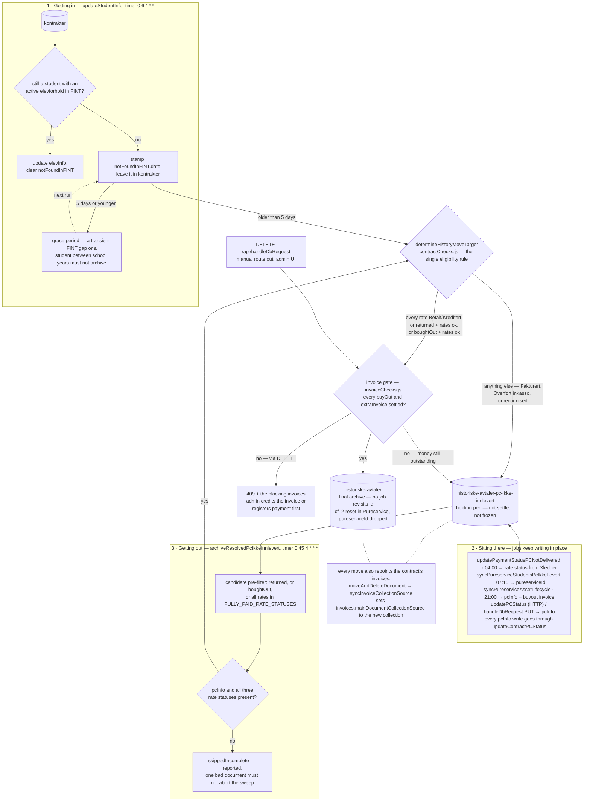

# The `historiske-avtaler-pc-ikke-innlevert` lifecycle

How a contract enters the "pc ikke innlevert" collection, what happens to it while it sits
there, and how it leaves.

## Flow at a glance



The rule and the invoice gate are drawn once on purpose: all three routes call the same two,
which is why the inbound router, the outbound sweep and the admin UI can never disagree about
where a contract belongs. A contract routed back to the holding pen from either gate is what the
sweep reports as `skippedStillUnresolved` / `skippedUnsettledInvoices`; the admin `DELETE` gets a
`409` instead, since there is a human to tell.

## What the collection means

`historiske-avtaler-pc-ikke-innlevert` (`MONGODB_HISTORIC_PC_NOT_DELIVERED_COLLECTION`) holds
contracts for students who are **no longer students**, but whose contract is **not settled** -
the PC was never handed back, or an invoice is still outstanding. It is a holding pen, not a
final archive; `historiske-avtaler` is the final archive.

The single rule deciding which of the two a contract belongs in is
`determineHistoryMoveTarget` (`src/lib/jobs/contractChecks.js`):

```
every rate in Betalt | Kreditert                                          → historiske-avtaler
returned === 'true'  AND every rate in Betalt | Skal ikke betale | Ikke Fakturert |
                                       Utlån faktureres ikke | Kreditert   → historiske-avtaler
boughtOut === 'true' AND every rate in Betalt | Skal ikke betale |
                                       Utlån faktureres ikke | Kreditert   → historiske-avtaler
anything else                                        → historiske-avtaler-pc-ikke-innlevert
```

`Fakturert` and `Overført inkasso` (and any unrecognized status) therefore always block the
final archive - they represent an unresolved invoice. Note `Ikke Fakturert` is acceptable for a
*returned* PC (nothing was ever billed, and never will be) but not for a *bought-out* one (the
buyout itself still has to be paid).

The first clause is the **fully-paid** path: a contract that owes nothing is done regardless of
what happened to the PC, so it archives even when neither `returned` nor `boughtOut` was ever
recorded - a Leieavtale paid for all three years is effectively the student's machine. Be aware
of the trade-off this makes: a PC that was never handed back and never bought out stops appearing
in this collection once the contract is paid up, so it is no longer on any outstanding-hardware
worklist. `Skal ikke betale` and `Utlån faktureres ikke` deliberately do **not** count as paid
here - they mean nothing was owed, not that anything was settled, so such a contract still needs
a PC disposition to leave.

Because this rule only ever looks at the contract's own `fakturaInfo`, it cannot see the
`invoices` collection - which is what the invoice gate below is for.

## The invoice gate

A contract can look completely settled in its own `fakturaInfo` while an invoice against it is
still unpaid. The `invoices` collection holds two kinds of document, both keyed by
`customerContractId`:

- **`buyOut`** - mirrors rates that also exist in the contract's `fakturaInfo`.
- **`extraInvoice`** - a damage charge or similar, with **no counterpart in `fakturaInfo` at
  all**. This is the case that motivates the gate: the rate rule structurally cannot see it.

So a contract never reaches `historiske-avtaler` while any invoice against it is unsettled. This
applies to **all three** archive paths - `updateStudentInfo` on the way in,
`archiveResolvedPcIkkeInnlevert` on the way out, and the admin UI's
`DELETE /api/handleDbRequest` - and lives in `src/lib/jobs/invoiceChecks.js` so they cannot
diverge.

An invoice counts as settled only when its **top-level `status` and every entry in `rates[]`** are
`Betalt` or `Kreditert`. Both halves are needed: nothing recomputes a `buyOut` invoice's top-level
status from its `rates[]`, so that value can always be behind what the rates actually say. (This
used to be phrased as "recomputed only inside `repairBuyOutInvoiceStatuses`" - that job is retired,
which makes the both-halves check more necessary, not less.) An `extraInvoice` carries `rates: []`
and is decided by its top-level status alone.

`Overført inkasso` deliberately does **not** count as settled here: an invoice reaching a final
state is not the same as the money being settled, and inkasso already blocks on the contract side.

The query matches `customerContractId` in both `ObjectId` and string form; it is written as a raw
`ObjectId` (`processInvoices.js`), but a missed invoice would mean wrongly archiving a contract
that still owes money, so both are covered. The builder lives in `src/lib/jobs/invoiceQueries.js`
rather than in `invoiceChecks.js`, because `queryMongoDB.js` needs it too and `invoiceChecks.js`
already requires `queryMongoDB.js` - a leaf module both can import avoids the require cycle.

## How an invoice finds its contract

Two fields on an invoice point at its contract, and they are not equally trustworthy.

**`customerContractId` is the reliable link.** `moveAndDeleteDocument` preserves `_id` across every
move (`findOne` then `insertOne(docToMove)`), so this value stays correct for the life of the
contract no matter how many collections it passes through. That is why the invoice gate above joins
on it alone.

**`mainDocumentCollectionSource` is a hint, not truth.** It records the `documentType`
(`regular` | `pcIkkeInnlevert` | `history`) the contract lived in *when the invoice was created*.
`moveAndDeleteDocument` now keeps it in step on every move, via `syncInvoiceCollectionSource` - but
that sync is best-effort by design: it runs after the move has been committed, so a failure there
logs and leaves a stale pointer rather than failing a half-completed move. **Anything about to write
to the contract must resolve the collection with `findContractById`
(`src/lib/jobs/findContract.js`) first**, and run the result through `assertContractUpdated`,
because `updateDocument` returns the raw Mongo result and never reports a miss.

The non-obvious part: **the invoice gate is what made this pointer go stale in the first place.**
`Fakturert` is not a settled status, so a student who leaves with a live buyOut invoice has their
contract routed to the holding pen - which is exactly the gate doing its job. The invoice, created
while the contract was still in `kontrakter`, went on saying `regular`. The buyOut import then wrote
the `Fakturert` rate data into `kontrakter`, matched nothing, logged success, and the contract was
stranded: its rate never got a `løpenummer`, so no payment sweep could match it, and it kept a
status `determineHistoryMoveTarget` accepts in no branch, so it could never leave the holding pen.

`historiske-avtaler` is **not** writable for these rate write-backs - it is the final archive. A
contract found there is reported for a manual move back out (its own Teams card from the Xledger
import) rather than written to. With the `DELETE` route now gated, a contract with a live invoice
should not be able to get in there at all, so that report means an invariant was broken.

`repairInvoiceCollectionSource` (`miscCleanUpJobs.js`, dry-run by default) resolves every invoice's
contract and repairs stale pointers, and reports the invoices whose contract cannot be resolved at
all - including a read-only probe of `duplicates` and `deleted`, which no contract lookup can reach.

## 1. Getting in

`updateStudentInfo` (`src/lib/jobs/updateStudentInfo.js`, timer `0 6 * * *`) is the only
automated router into the collection. Per contract in `kontrakter`:

1. Asks FINT whether the person is still a student with an active elevforhold.
2. If not, stamps `notFoundInFINT.date` and leaves the contract in `kontrakter`.
3. On a later run, once that date is **more than 5 days old**, calls
   `determineHistoryMoveTarget` and moves the contract to whichever collection it names.
4. Before actually archiving to `historiske-avtaler`, applies the invoice gate: if any invoice
   against the contract is unsettled, it is routed here to the holding pen instead. It then leaves
   the normal way, once the invoice is paid and the daily sweep sees it.

The 5-day grace period exists so a transient FINT gap or a student between school years doesn't
archive an active contract.

Step 4 matters because `historiske-avtaler` is a one-way destination: no job revisits it, and the
Pureservice link has been cleared by the time the document lands there (see "Why leaving matters
beyond tidiness"). A contract that still owes money must not end up there.

## 2. Sitting there

Documents in this collection are **not** frozen. Several jobs keep writing to them in place:

| Job | Trigger | What it writes |
|---|---|---|
| `updatePaymentStatusPCNotDelivered` | timer `0 4 * * *` | rate `status` → `Betalt` / `Kreditert` from Xledger |
| `archiveResolvedPcIkkeInnlevert` | timer `0 45 4 * * *` | nothing - moves settled contracts out, see below |
| `syncPureserviceStudentsPcIkkeLevert` | timer `15 7 * * *` | `pureserviceId` / Pureservice student sync |
| `syncPureserviceAssetLifecycle` | timer `0 0 21 * * *` | `pcInfo.released` / `returned` / `boughtOut`, plus buyout invoices |
| `updatePCStatus` | HTTP, called by Pureservice | `pcInfo.*` (falls back to this collection when the contract isn't in `kontrakter`) |
| `handleDbRequest` PUT | HTTP, admin UI | `pcInfo.*` via `updateContractPCStatus`, or arbitrary fields via `updateDocument` |
| `markCherwellPcReturns` | manual, `devTesting.js` | one-off `pcInfo.returned` backfill from a Cherwell export |

Every `pcInfo` write goes through `updateContractPCStatus` (`src/lib/jobs/queryMongoDB.js`),
never a hand-rolled `$set`: `pcInfo` is a state machine, and that function is the single place
that knows a PC cannot be both released and returned.

## 3. Getting out

Because of step 2, a contract routinely *becomes* settled after it was archived here - a rate
gets paid, or the PC is finally handed in and registered in Pureservice. Nothing re-ran the
routing decision, so those contracts used to accumulate indefinitely, waiting for someone to
notice them in the admin UI.

**`archiveResolvedPcIkkeInnlevert`** (`src/lib/jobs/archiveResolvedPcIkkeInnlevert.js`, timer
`0 45 4 * * *`) closes that gap. It is deliberately just a second caller of
`determineHistoryMoveTarget` - it has no eligibility rules of its own, so the two directions can
never disagree.

1. Fetches candidates with a pre-filter - contracts that are returned, bought out, **or** have
   every rate in `Betalt`/`Kreditert`. The rule can only answer `historic` in one of those three
   shapes, so this is exactly the candidate set. The fully-paid branch is built from
   `FULLY_PAID_RATE_STATUSES`, imported from `contractChecks.js` rather than repeated, so the
   query and the rule cannot drift apart.
2. Skips (and reports) any document missing `pcInfo` or a rate `status` -
   `determineHistoryMoveTarget` dereferences those unguarded, and one malformed document must
   not abort the sweep.
3. Asks `determineHistoryMoveTarget`. Anything but `historic` stays put and is reported under
   `skippedStillUnresolved` **together with its three rate statuses**, which is the whole
   explanation for the skip.
4. Applies the invoice gate (above). A blocked contract is reported under
   `skippedUnsettledInvoices` with the offending invoices.
5. Otherwise `moveAndDeleteDocument(_id, 'historic', 'pcIkkeInnlevert')`.

Processing is strictly sequential, not `Promise.all`: each move to `historic` issues a
Pureservice `patchUser` call (see below), and an end-of-year mass return can put hundreds of
documents in here at once. Same reasoning as
[docs/pureservice-asset-lifecycle.md](pureservice-asset-lifecycle.md#rate-limiting).

For step 4 the sweep fetches **all** candidates' invoices in one query and groups them by
contract id (`fetchInvoicesByContract`) - the bulk pre-filter pattern from
`syncPureserviceAssetLifecycle`, not one query per candidate. `updateStudentInfo` uses the
single-contract `getUnsettledInvoices` instead, since only a handful of documents per run reach
the archive decision there.

The **manual** route out is still available: `DELETE /api/handleDbRequest` with
`{ contractID, targetCollection: 'historic', sourceCollection: 'pcIkkeInnlevert' }`, which is
what the admin UI calls. It is no longer unconditional, though:

- Archiving to `historic` applies the same invoice gate as the automated paths. If any invoice
  against the contract is unsettled the call returns **`409`** with the blocking invoices in the
  body, so the UI can show *which* invoice is holding the contract back. There is no force
  override - the way to archive a contract with a written-off invoice is to mark that invoice
  `Kreditert`, which the gate then accepts.
- `targetCollection` and `sourceCollection` are allowlisted against the vocabularies
  `moveAndDeleteDocument` actually accepts (exported from `queryMongoDB.js` so there is one
  definition), returning `400` on anything else. Previously an unknown source reached
  `.collection(null)` and threw, and an unknown target left the collection name empty and threw on
  `createCollection('')`.

This mattered because the `DELETE` was the one remaining route that could put a contract with a
live invoice into the final archive - where no job revisits it and the Pureservice link has already
been cleared. Note the endpoint is reachable with only a `?school` query param when the
`elevkontrakt.administrator-readwrite` role check fails, so the gate has to live in the backend;
hiding the action in the admin UI would not hold.

### Why leaving matters beyond tidiness

`moveAndDeleteDocument`'s `historic` branch is the only place that resets `cf_2` in Pureservice
and drops `pureserviceId` from the document - contracts in `historiske-avtaler` are done for
good and no mapper watches that collection, so a stale value there would never be corrected. A
contract stranded in `historiske-avtaler-pc-ikke-innlevert` therefore also keeps a stale
Pureservice link forever. If that `patchUser` call fails the whole move is aborted (`502`) and
the document is left in place, to be retried on the next run.

## Dry run

Defaults to a **dry-run preview**, matching this codebase's
`markCherwellPcReturns(false)` / `mergeAndArchiveDuplicateContracts(false)` convention. No writes
happen unless `dryRun: false` is passed explicitly. The timer trigger opts in at its call site;
the dev HTTP endpoint stays a safe preview unless `?dryRun=false` is given. A dry run also skips
the Teams report, so the dev endpoint can be poked without notifying anyone.

## Schedule

`0 45 4 * * *` - daily at 04:45, deliberately at the back of the early-morning chain:
`updatePaymentStatusPCNotDelivered` (04:00) refreshes rate statuses in this very collection,
followed by the extra-invoice (04:15) and buyout (04:30) sweeps. 04:45 sees all of their writes
plus the previous evening's `syncPureserviceAssetLifecycle` (21:00) `pcInfo` backfill, and still
lands before `updatePaymentStatus` (05:00) and `updateStudentInfo` (06:00).

## Manual trigger (dev)

```
GET http://localhost:7071/api/dev/archiveResolvedPcIkkeInnlevert
GET http://localhost:7071/api/dev/archiveResolvedPcIkkeInnlevert?dryRun=false
```

Example dry-run response:

```json
{
  "dryRun": true,
  "candidates": 34,
  "archived": [
    { "documentId": "...", "navn": "...", "kontraktType": "Leieavtale",
      "rateStatuses": ["Betalt", "Betalt", "Betalt"], "moved": false }
  ],
  "skippedStillUnresolved": [
    { "documentId": "...", "navn": "...", "kontraktType": "Leieavtale",
      "rateStatuses": ["Betalt", "Fakturert", "Ikke Fakturert"] }
  ],
  "skippedUnsettledInvoices": [
    { "documentId": "...", "navn": "...", "kontraktType": "Leieavtale",
      "rateStatuses": ["Betalt", "Betalt", "Betalt"],
      "invoices": [
        { "invoiceId": "...", "type": "extraInvoice", "status": "Ikke Fakturert", "rateStatuses": [] }
      ] }
  ],
  "skippedIncomplete": [],
  "errors": []
}
```

## Relevant files

| File | Purpose |
|------|---------|
| `src/lib/jobs/contractChecks.js` | `determineHistoryMoveTarget` - the single eligibility rule, shared by all archive paths |
| `src/lib/jobs/invoiceChecks.js` | The invoice gate - `isInvoiceSettled`, `getUnsettledInvoices`, `fetchInvoicesByContract`, `describeInvoice` |
| `src/lib/jobs/invoiceQueries.js` | `invoiceQueryForContractIds` - the `ObjectId`/string `$in`, in a leaf so both `invoiceChecks` and `queryMongoDB` can use it |
| `src/lib/jobs/findContract.js` | `findContractById` - resolves a contract's collection by `_id`; the authority `mainDocumentCollectionSource` is only a hint for. Also `assertContractUpdated` |
| `src/lib/jobs/updateStudentInfo.js` | Routes contracts *into* the collection when a student leaves |
| `src/lib/jobs/archiveResolvedPcIkkeInnlevert.js` | Sweeps settled contracts *out* to `historiske-avtaler` |
| `src/functions/archiveResolvedPcIkkeInnlevert.js` | Timer + dev HTTP trigger |
| `src/lib/jobs/queryMongoDB.js` | `moveAndDeleteDocument` (incl. the Pureservice `cf_2` reset and `syncInvoiceCollectionSource`), `updateContractPCStatus`, the move-collection allowlists |
| `src/lib/jobs/processInvoices.js` | Writes the `buyOut` / `extraInvoice` documents the invoice gate reads |
| `src/lib/jobs/serverJobs/xledgerInvoiceImport.js` | The buyOut rate write-back - resolves the contract's collection, and reports what it could not update |
| `src/lib/jobs/serverJobs/miscCleanUpJobs.js` | `repairInvoiceCollectionSource` - repairs stale invoice pointers (`repairBuyOutInvoiceStatuses` is retired) |
| `src/functions/handleDbRequest.js` | The manual, admin-UI-driven move (`DELETE`), now invoice-gated |
| `docs/pureservice-asset-lifecycle.md` | The job that backfills `pcInfo` here from Pureservice |
