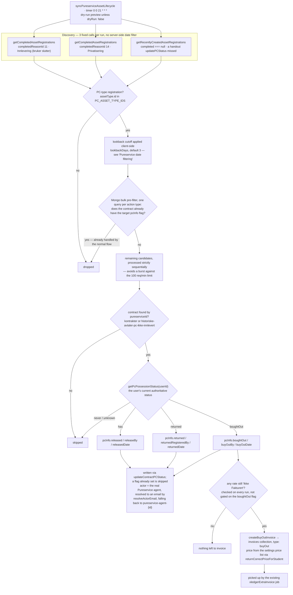

# Pureservice PC Lifecycle Sync

Syncs a student's PC lifecycle (released / returned / bought out) from Pureservice's
`AssetRegistration` data onto the matching contract in MongoDB, and automatically invoices
the remaining unpaid rate(s) when a PC is bought out.

## Why

`updatePCStatus` (see `src/functions/updatePCStatus.js`) is called by Pureservice's own
workflow whenever a PC is handed out - but that's a single HTTP
call with no retry if it fails or never arrives. There's also no way to pick up returned, or bought out actions this way.
This job is a daily safety net so we can pick up all actions: it reads Pureservice's `AssetRegistration` history directly and backfills anything `updatePCStatus`
missed, and additionally auto-creates the buyout invoice (the manual/cart-based flow does
not do this automatically).

## How it works

1. Fetches recently completed `AssetRegistration` records for the two known "leaving"
   reasons - `completedReasonId 11` ("Innlevering (bruker slutter)") and `14`
   ("Privatisering") - plus recently *created* records still active (`completed === null`),
   to catch a PC handout whose `updatePCStatus` call never landed. "Recently" is applied
   **client-side**, not as a server-side date filter - see "Pureservice date filtering" below.
2. Keeps only PC-type registrations (`assetType.id === 3`, confirmed against this
   Pureservice instance's asset type list).
3. Bulk-checks in MongoDB which of those candidates' contracts don't already have the
   corresponding `pcInfo` flag set (`released`/`returned`/`boughtOut`) - skips the rest
   without any further Pureservice calls.
4. For each remaining candidate, asks `getPcPossessionStatus` (see
   `pureservice-asset-lifecycle` classification logic in
   `src/lib/jobs/pureserviceAssetLifecycle.js`) for the user's *current* authoritative
   status, and finds their contract by `pureserviceId`.
5. Dispatches based on that status:
   - **`has`** → backfills `pcInfo.released` / `releaseBy` / `releasedDate`, if not already set.
   - **`returned`** → backfills `pcInfo.returned` / `returnedRegisteredBy` / `returnedDate`.
   - **`boughtOut`** → backfills `pcInfo.boughtOut` / `buyOutBy` / `buyOutDate`, and - always,
     independent of whether the pcInfo write just happened - invoices every remaining
     `'Ikke Fakturert'` rate. Per-rate price comes from the same `settings`-collection price
     list and `returnCorrectPriceForStudent` logic the recurring rent invoicing job uses.
   - Anything else (`never`/`unknown`) is skipped and logged.
6. The "who did this" actor recorded on `pcInfo.*By` is the real Pureservice agent who
   completed the registration (`completedById`/`createdById`), resolved to an email - not a
   generic sentinel. Falls back to `pureservice-agent-{id}` if that lookup fails.

## Flow at a glance



Invoicing is **self-healing**: it isn't gated on the `pcInfo.boughtOut` flag (a one-time
write), only on whether a rate is still `'Ikke Fakturert'` - so a failed invoice attempt on
one run gets retried automatically on the next, even though the pcInfo flag is already set.

## Result fields

```json
{
  "pcInfo": {
    "released": "true", "releaseBy": "...", "releasedDate": "...",
    "returned": "true", "returnedRegisteredBy": "...", "returnedDate": "...",
    "boughtOut": "true", "buyOutBy": "...", "buyOutDate": "..."
  }
}
```

A buyout also creates an `invoices` collection document (`type: "buyOut"`), same shape as
the manual cart-checkout flow (`postExtraInvoice`), picked up by the existing
`xledgerExtraInvoice` job.

## Dry run

Defaults to a **dry-run preview** - matching this codebase's existing
`mergeAndArchiveDuplicateContracts(false)`-style convention
(`src/lib/jobs/serverJobs/miscCleanUpJobs.js`). No writes happen unless `dryRun: false` is
explicitly passed. The scheduled timer trigger opts into real writes explicitly at its call
site; the dev HTTP endpoint stays a safe preview unless `?dryRun=false` is passed.

## Lookback window

`lookbackDays` (default `3`) is a runtime parameter, not a fixed constant - pass a larger
value to catch up after a missed run, or an intentionally large one (e.g. `365`) for a
one-off deep backfill. Safe to widen because processing is idempotent (skips anything
already marked) and invoicing is self-healing (see above).

## Schedule

Runs daily at **21:00** via Azure Functions timer trigger (`0 0 21 * * *`).

## Environment variables

Same as the other Pureservice-integrated jobs:

| Variable  | Description                          |
|-----------|--------------------------------------|
| `PUS_URL` | Pureservice base URL, e.g. `https://telemark.pureservice.com` |
| `PUS_KEY` | Pureservice API key                                           |

## Manual trigger (dev)

```
GET http://localhost:7071/api/dev/syncPureserviceAssetLifecycle
GET http://localhost:7071/api/dev/syncPureserviceAssetLifecycle?lookbackDays=30
GET http://localhost:7071/api/dev/syncPureserviceAssetLifecycle?dryRun=false
GET http://localhost:7071/api/dev/syncPureserviceAssetLifecycle?pureserviceId=345
```

`pureserviceId` skips discovery entirely and processes only that one Pureservice user - use
this to test against a single known user (e.g. the 345/1589 test users referenced above)
instead of running the full discovery sweep. Combine with `dryRun=false` only once the
dry-run preview for that user looks right.

Example dry-run response:

```json
{
  "released": [],
  "returned": [{ "action": "return", "contractId": "...", "actorEmail": "agent@pureservice.no" }],
  "boughtOut": [
    { "action": "boughtOut", "contractId": "...", "actorEmail": "agent@pureservice.no" },
    { "action": "buyOutInvoice", "contractId": "...", "items": [{ "faktureringsår": 2026, "sum": "1500" }], "total": 1500 }
  ],
  "skipped": [],
  "errors": [],
  "dryRun": true
}
```

## Relevant files

| File | Purpose |
|------|---------|
| `src/lib/jobs/queryPureservice.js` | Pureservice API client - `getCompletedAssetRegistrations`, `getRecentlyCreatedAssetRegistrations` |
| `src/lib/jobs/pureserviceAssetLifecycle.js` | `getPcPossessionStatus` / `classifyPcPossession` - the has/returned/boughtOut classification |
| `src/lib/jobs/updatePCStatus.js` | `findContractByPureserviceId` (shared lookup) / `updatePCStatus` (the HTTP-driven manual flow) |
| `src/lib/jobs/processInvoices.js` | `createBuyOutInvoice` (shared with the manual cart-checkout flow) |
| `src/lib/jobs/syncPureserviceAssetLifecycle.js` | This job's orchestration logic |
| `src/functions/syncPureserviceAssetLifecycle.js` | Azure Function timer + dev HTTP trigger |
| `src/lib/helpers/getSettings.js`, `getCorrectRatePrice.js` | Pricing (shared with the recurring rent invoicing job) |

## Pureservice date filtering

Comparing a `DateTimeOffset` field (`completed`, `created`) with `>` in Pureservice's filter
grammar **400s no matter how the date value is written** - confirmed live against this
instance:

- Quoted (`completed > "2026-08-31T12:00:00Z"`) → `Operator '>' incompatible with operand
  types 'DateTimeOffset?' and 'String'` (the quoted value parses as a `String` literal).
- Unquoted (`completed > 2026-08-31T12:00:00Z`) → `...and 'Int32'` (the `-` characters in the
  date get parsed as arithmetic subtraction, not as part of a date literal).

No form producing a `DateTimeOffset`-typed operand was found. So `getCompletedAssetRegistrations`
and `getRecentlyCreatedAssetRegistrations` (`src/lib/jobs/queryPureservice.js`) send **no date
filter at all** - only `completedReasonId == X` (or nothing, for the "recently created" query) -
and apply the lookback cutoff entirely **client-side** in `fetchRecentAssetRegistrationPages`,
after fetching.

An earlier version of that function also *sorted* by the cutoff field descending and stopped
paging as soon as one out-of-window item appeared, to avoid fetching full history every run.
That assumed `sort=completed DESC` (and, on this unfiltered/global endpoint, `sort=created DESC`)
is honored by Pureservice - unverified, and **disproven live**: a 200-day lookback still found
zero results for a `completedReasonId` known to have real completions in that window, meaning
whatever order the API actually returned wasn't chronological. `fetchRecentAssetRegistrationPages`
now pages every result to an empty page (default `sort=id`, the one sort key this codebase has
verified elsewhere) and filters by date only after the full set is collected - no early exit.
This trades away the "recent records + one extra page" bound in favor of correctness; see "Rate
limiting" below for how call volume is still kept down without it. **Do not reintroduce an
early exit here without first confirming `sort=<field>` is actually honored for that exact field
on this exact endpoint.**

## Rate limiting

The Pureservice API returns HTTP 429 when rate limited. The client retries up to 7 times,
honouring the `Retry-After` response header (or falling back to a 15-second wait) - see
`pureservice-sync.md` for the detail, unchanged here.

On top of that, this job keeps its own Pureservice call volume down two ways:

- A MongoDB pre-filter (bulk, one query per action type) excludes any candidate whose
  contract already has the target `pcInfo` flag set, *before* any per-candidate Pureservice
  call - this matters because a back-to-school PC rollout or an end-of-year mass return can
  surface hundreds of candidates in one run, the overwhelming majority already handled by
  the normal `updatePCStatus` flow.
- What's left after the pre-filter is processed **strictly sequentially** (not
  `Promise.all`), avoiding a concurrent burst against the 100 req/min limit. There is no
  proactive throttle beyond that - a very large remaining batch just takes longer, paced out
  by the existing retry/backoff, rather than failing.
- Discovery itself now also has no early-exit bound (see "Pureservice date filtering" above) -
  `getCompletedAssetRegistrations` pages through every registration ever completed with a given
  reason, and `getRecentlyCreatedAssetRegistrations` pages through every AssetRegistration in
  the system, of every asset type. Both are 500-per-page, sequential, and only run once per
  invocation (not per candidate), so this is still bounded and safe - just no longer capped to
  "recent records only" the way the removed early exit intended.
